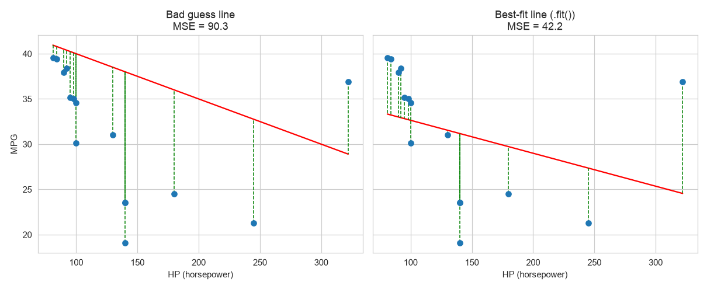
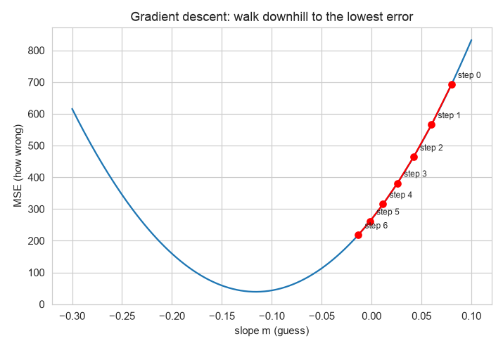
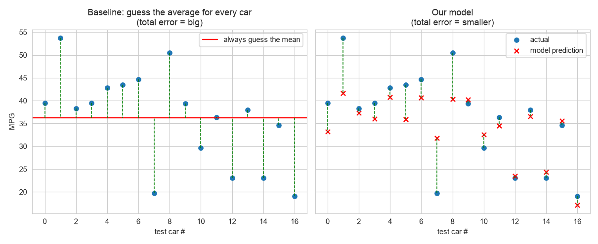
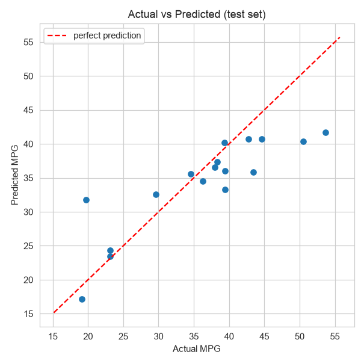
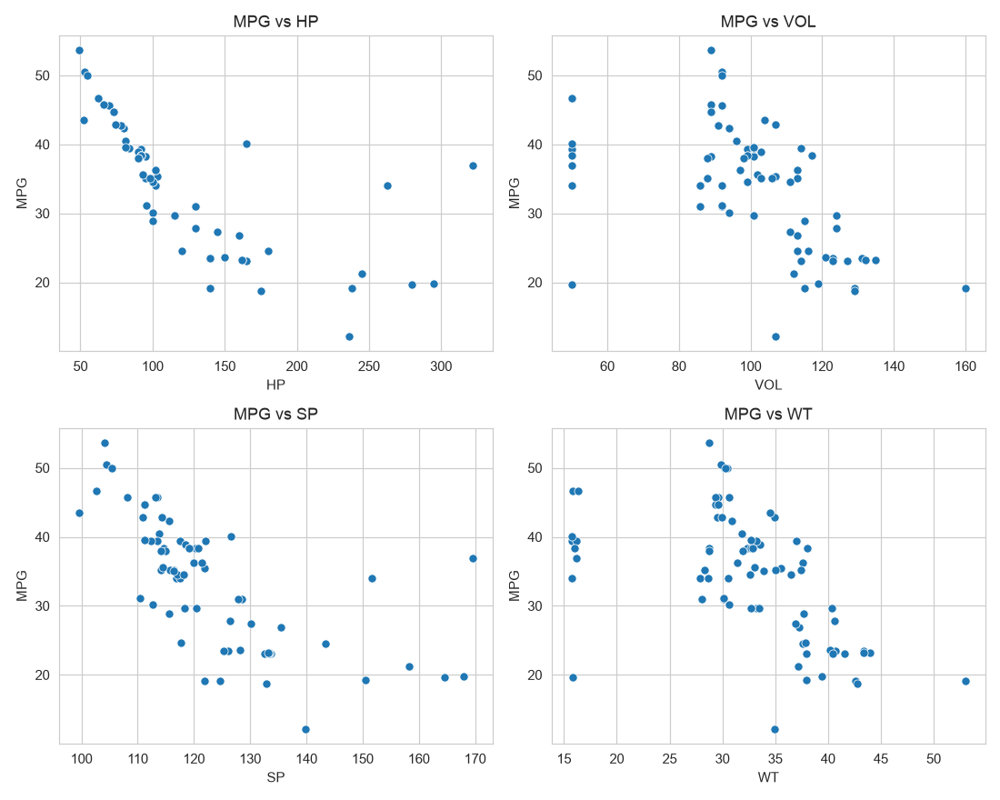
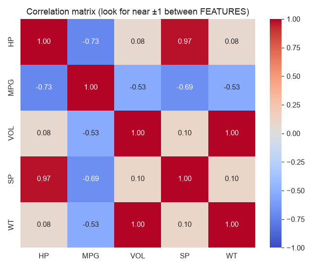
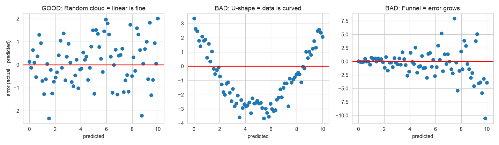
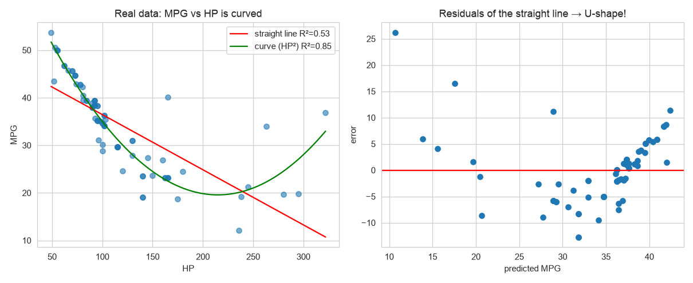
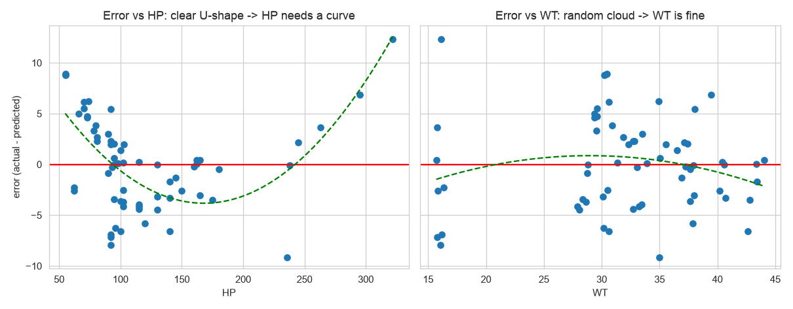

# Chapter 2 — Linear Regression (Theory)

> **How to use the two files in this folder**
> - **`theory.md` (this file):** learn the concepts. What each thing is, why it exists, how to read it, what to do about it.
> - **`recap.md`:** revise by walking through the real car-MPG project (`scripting.ipynb`) step by step, with every number and a final checklist.
>
> All graphs are in `images/` and are made from the real `Cars.csv` data.

**Notation:** this file uses school-algebra `y = mx + b`. Elsewhere you may see `ŷ = wx + b` or `ŷ = β₀ + β₁x`. **They're the same formula** (`w` or `β₁` = slope `m`, `β₀` = intercept `b`).

---

## 0. Where Linear Regression sits

From Chapter 1, Linear Regression is:
- **Supervised:** it learns from rows where the answer is known.
- **Regression:** it predicts a **number** (price, MPG, salary).
- **Parametric:** it learns a few fixed numbers (`m`'s and `b`), then doesn't need the data anymore.

It's the first algorithm to learn because almost every idea in it (error, loss, gradient descent, train/test, metrics) is reused by every other model, **including neural networks and LLMs**.

---

## 1. The idea: fit a straight line

You know some houses' size and sale price. You want to predict the price of a new house.

| Sq ft (x) | Price in $1000s (y) |
|---|---|
| 500 | 150 |
| 1000 | 200 |
| 1500 | 250 |
| 2000 | 300 |
| 2500 | 350 |

Every +500 sq ft adds +50 to the price, so it's a **straight line**. Linear Regression's job is to **find the line**, then read predictions off it.

```
y = m·x + b
```

| Symbol | Name | Meaning | Here |
|---|---|---|---|
| `x` | **feature** / input | what you know | sq ft |
| `y` | **target** / actual | the real answer | price |
| `ŷ` ("y-hat") | **prediction** | what the line says | — |
| `m` | **slope** | change in y for +1 x | 0.1 ($100 per sq ft) |
| `b` | **intercept** | value of y when x = 0 (a maths anchor, often not meaningful in real life) | 100 |

For this clean data: `y = 0.1x + 100`. Check: x = 1000 → 0.1×1000 + 100 = 200 ✓

**The whole model is just 2 numbers (`m` and `b`).** Training = finding them.

---

## 2. Real data is messy, so we need "learning"

| Sq ft (x) | Actual price (y) |
|---|---|
| 500 | 160 |
| 1000 | 190 |
| 1500 | 260 |
| 2000 | 290 |
| 2500 | 355 |

Now **no line passes through every point.** Can we just pick 2 points and compute rise ÷ run?

- (500,160) & (1000,190) → m = 30/500 = **0.06**
- (1500,260) & (2500,355) → m = 95/1000 = **0.095**
- (500,160) & (2500,355) → m = 195/2000 = **0.0975**

**3 pairs → 3 different slopes.** Each one ignores the other points. We need a method that uses **every point at once** and finds the **best compromise line**. For that we first need a way to measure "how wrong" a line is.

---

## 3. Measuring "how wrong": residuals and the cost function (MSE)

### Definitions
- **Residual (error)** = `actual − predicted` for **one row**.
  - `+` → the line guessed **too low**. `−` → it guessed **too high**.
- **Cost function (loss)** = **one number** that summarises how wrong the line is across **all rows**. Training tries to make it as small as possible.

### Why not just add up the errors?
`+10` and `−10` add up to `0` and look "perfect" even though both rows are badly off. So we remove the sign by **squaring** each error. Squaring also **punishes big misses more** (an error of 10 becomes 100, an error of 2 becomes 4).

### MSE: Mean Squared Error
```
MSE = average of (actual − predicted)²
```
**Lower MSE = better line.**

### See it
Each blue dot is a real car, the red line is a guess, and the green dashed lines are the errors:



Left: a bad guess, long green lines, MSE 90.3. Right: the best-fit line, shorter green lines, MSE 42.2.

### Small worked example: comparing two lines by hand

| x | actual y | Line A `4x+20` | error² | Line B `4.5x+15` | error² |
|---|---|---|---|---|---|
| 10 | 65 | 60 | 25 | 60 | 25 |
| 15 | 88 | 80 | 64 | 82.5 | 30.25 |
| 20 | 105 | 100 | 25 | 105 | 0 |
| 25 | 130 | 120 | 100 | 127.5 | 6.25 |
| | | **MSE A** | **53.5** | **MSE B** | **15.375** |

Line B has the lower MSE, so it fits better. Training does exactly this comparison, but automatically, across every possible `m` and `b`.

---

## 4. Finding the best `m` and `b`

### Method A: OLS (Ordinary Least Squares), a direct formula
A maths formula that calculates the `m` and `b` with the **smallest possible MSE** in one shot. "Least squares" literally means "smallest squared errors".
- On the messy house data: **m = 0.098, b = 104**.
- The MSE of a flat, useless line (m=0, b=0) = 67,885. The MSE of the OLS line = **82**.
- **sklearn's `LinearRegression().fit()` uses OLS.**

### Method B: Gradient Descent, walking downhill
Start with a guess, measure the error, take a **small step** in the direction that reduces it, and repeat.



- The blue curve = MSE for every possible slope. The lowest point = the best slope.
- The red dots = gradient descent steps, walking **downhill** until the error stops dropping.
- Update rule, in words: `new m = old m − learning_rate × (direction that increases error)`.
- **Learning rate** = step size. Too big → it overshoots and bounces around. Too small → it's very slow.
- On the house data, **one step** already dropped MSE from 67,885 → 15,380. Many steps reach OLS's answer.

| | OLS | Gradient Descent |
|---|---|---|
| How | One formula, exact answer | Many small steps, gets close |
| Speed | Instant | Many iterations |
| Used by | Linear Regression | Logistic Regression, **neural networks, LLMs** |

### Do I need to do this by hand?
**No.** `.fit(X, y)` does all of it, whether you have 5 rows or 10 million. You never compute slope or standard deviation yourself first.

**Why learn it then?** Because **every neural network, including GPT and Claude, is trained with exactly these two ideas**: a **loss** ("how wrong am I") plus **gradient descent** ("step downhill"), just over billions of numbers instead of 2. Interviews for AI roles ask about both.

| Understand the idea ⭐ | Just know it exists |
|---|---|
| `y = mx + b`, residual, **MSE**, **gradient descent**, learning rate | The OLS formula, partial derivatives |

### Using the trained model
Once `m` and `b` are learned, prediction is just plugging in numbers. A new house of 1800 sq ft: `0.098 × 1800 + 104 = 280.4` → **$280,400**.

---

## 5. More than one feature (Multiple Linear Regression)

```
y = m1·x1 + m2·x2 + m3·x3 + … + b
```
- Each feature gets **its own slope**, and there's **one** `b`.
- `m1` = the effect of x1 **while the other features stay the same**.
- The **shape never changes.** Only the number of `x`'s and the learned values change. The method (MSE + OLS/gradient descent) is always the same.

---

## 6. Evaluating the model: is it any good?

### Train/test split: why we hide some data
- **Training set (~80%)** = practice questions. `fit()` learns from these only.
- **Test set (~20%)** = the real exam. The model **never sees these while learning**. We only call `predict()` on them.
- Why: a model tested on its own training rows could just memorise them and look perfect. The test set shows whether it **really learned the pattern**.
- **Split before `fit()`, and never `fit()` on the test set.**

### The baseline: the "no ML" answer
**Baseline** = always predict the **average** of the training target, ignoring every feature (sklearn has `DummyRegressor` for this).
- **Every model must beat the baseline**, or the ML added nothing.
- The classification version (Ch. 3) is to always predict the most common class.

### The metrics
For each test row: `error = actual − predicted`. Then:

| Metric | How | Meaning | Use it for |
|---|---|---|---|
| **MAE** | average of \|error\| | "a typical miss is X units" | Easy to explain; treats every miss equally |
| **MSE** | average of error² | squared units, not readable | **Training** (it's what `.fit()` minimises) |
| **RMSE** | √MSE | "typically off by X units", with **big misses weighted more** | Reporting, when big misses are especially bad |
| **R²** | 1 − (model's squared error ÷ baseline's squared error) | **how much better than guessing the average** | Comparing models on the same data |

**Reading R²:**
- **1** = perfect. **0** = no better than the average. **Below 0** = worse than the average.
- **0.675** = the model removed 67.5% of the baseline's error.
- There's no universal "good" R². It depends on the domain and the business target.

**Reading RMSE vs MAE:** RMSE ≥ MAE always. **A big gap = a few large misses**, because squaring inflates them.

### Worked example with real numbers (17 test cars)

| Car | Actual | Predicted | Error | \|Error\| | Error² | (Actual − avg 36.18)² |
|---|---|---|---|---|---|---|
| 1 | 39.4 | 33.3 | +6.2 | 6.2 | 38.2 | 10.6 |
| 2 | 53.7 | 41.7 | +12.0 | 12.0 | 144.7 | 307.0 |
| 3 | 38.3 | 37.3 | +1.0 | 1.0 | 0.9 | 4.5 |
| 4 | 39.4 | 36.0 | +3.4 | 3.4 | 11.6 | 10.6 |
| 5 | 42.8 | 40.7 | +2.1 | 2.1 | 4.2 | 43.7 |
| 6 | 43.5 | 35.9 | +7.6 | 7.6 | 57.9 | 53.1 |
| 7 | 44.7 | 40.7 | +4.0 | 4.0 | 15.8 | 71.8 |
| 8 | 19.7 | 31.8 | −12.1 | 12.1 | 146.7 | 272.3 |
| 9 | 50.5 | 40.4 | +10.1 | 10.1 | 102.4 | 205.2 |
| 10 | 39.4 | 40.2 | −0.8 | 0.8 | 0.7 | 10.1 |
| 11 | 29.6 | 32.6 | −3.0 | 3.0 | 8.9 | 42.9 |
| 12 | 36.3 | 34.5 | +1.7 | 1.7 | 3.0 | 0.0 |
| 13 | 23.1 | 23.4 | −0.3 | 0.3 | 0.1 | 171.0 |
| 14 | 38.0 | 36.5 | +1.4 | 1.4 | 2.0 | 3.2 |
| 15 | 23.1 | 24.4 | −1.3 | 1.3 | 1.6 | 171.0 |
| 16 | 34.6 | 35.6 | −1.0 | 1.0 | 1.0 | 2.6 |
| 17 | 19.1 | 17.2 | +1.9 | 1.9 | 3.7 | 292.2 |
| **SUM** | | | | **69.9** | **543.4** | **1671.7** |

```
MAE  = 69.9 / 17         = 4.11 MPG
MSE  = 543.4 / 17        = 31.96 MPG²
RMSE = √31.96            = 5.65 MPG
R²   = 1 − 543.4/1671.7  = 1 − 0.325 = 0.675
```
- **1671.7** = the total squared error if you always guess the average (left graph below).
- **543.4** = the total squared error of the model (right graph below).



*(R² uses the test set's own average, 36.18. The baseline RMSE of 10.16 uses the training average, 33.96, because in real life you only know the training data.)*

### Actual vs predicted plot


Perfect predictions would sit on the red diagonal. Dots far from it = cars where the model struggled.

### Metrics aren't specific to Linear Regression
MAE, MSE, RMSE and R² work for **every regression model**: trees, Random Forest, XGBoost, neural networks. That's what lets you compare different models fairly.
- **Number target** → MAE / MSE / RMSE / R².
- **Category target** → accuracy, precision, recall, F1, AUC (Ch. 3–4).

---

## 7. Assumptions: when can a straight line be trusted?

Linear Regression **assumes a shape** (a straight line), so the data has to roughly cooperate:

| Assumption | Meaning | Broken example |
|---|---|---|
| **Linearity** | The real relationship is roughly straight | MPG drops fast then flattens as HP grows |
| **Independence** | One row's error doesn't predict another's | Time series (today's error ≈ yesterday's) |
| **Homoscedasticity** | Errors are about the same size everywhere | Small errors on cheap houses, huge ones on expensive houses |
| **Normal errors** | Errors form a bell curve | Heavily skewed errors |
| **No multicollinearity** | Features aren't near-duplicates | `length_cm` + `length_inches` |

**Do these apply to other models?** Mostly not. They exist because of the straight-line assumption.

| Assumption | Linear / Logistic | Trees / RF / XGBoost |
|---|---|---|
| Linearity | ✅ needed | ❌ trees handle curves themselves |
| No multicollinearity | ✅ if you **read the coefficients** | ❌ mostly fine |
| Homoscedasticity, Normal errors | ⚠️ only for statistical confidence ranges | ❌ |
| **Independence** | ✅ | ✅ **all models**. For time data, train on the past and test on the future. |

**Priority for a dev:** linearity and multicollinearity for linear models, and independence for everything. The other two: know the names.

---

## 8. Diagnosing problems: how to read the graphs

### 8.1 Feature vs target scatter plot (before training)
Each dot = one row: x-position = feature value, y-position = target.



**Ask 5 questions of every scatter plot:**

| # | Question | How to see it | Why it matters |
|---|---|---|---|
| 1 | **Direction?** | ↗ positive, ↘ negative, flat = none | The sign the `m` *should* have |
| 2 | **Straight or curved?** | Does one straight line fit, or do the dots bend? | A bend → a straight line will miss |
| 3 | **Strong or weak?** | Tight band = strong, wide cloud = weak | Strong features predict better |
| 4 | **Outliers?** | Dots far from the rest | They can pull the line. Real, or data errors? |
| 5 | **Do two plots look the same?** | Compare shapes across features | Hints at duplicate features |

Limit: this only works for 1–2 features at a time. With many features, use the residual plots (8.3).

### 8.2 Correlation matrix and multicollinearity
**Correlation** runs from −1 to +1. Close to ±1 = two columns move together almost perfectly.



**Multicollinearity** = two or more **features** are near-duplicates (here VOL–WT = 1.00, HP–SP = 0.97).

**What it breaks:** the model can't tell which twin deserves the credit, so it splits and even **flips the signs** of their `m`'s. In the car model, SP and WT came out **positive** ("heavier cars get better mileage") even though both clearly go ↘ on their own.

**Analogy:** two friends always arrive at a party together, and the party gets louder. You can't tell who made the noise. Blaming A +10 and B −5, or A −5 and B +10, gives the same total (+5). The **prediction is fine**, but the **individual blame is meaningless**.

**Key idea: a model can predict well but explain badly.**
- **Prediction** ("what MPG?") → judged by RMSE/R². Multicollinearity barely hurts it.
- **Explanation** ("which feature matters, and how much?") → the `m`'s. Multicollinearity breaks this.

**What to do:**
1. Check `df.corr()` **between features**. Anything above about 0.9 = twins.
2. Compare each `m`'s sign with its scatter-plot direction. A mismatch = suspect twins.
3. Drop one of each twin, then retrain. Fewer, non-duplicate features often predict **better** too.

### 8.3 The residual plot (after training): the main diagnostic
**Residual plot** = one dot per row. **x = predicted**, **y = residual** (actual − predicted), and a red line at 0.

**Why it's needed:** RMSE/R² say **how much** the model is wrong, but not **where or why**. The residual plot shows whether the mistakes follow a **pattern**.
- **Random mistakes** = only unpredictable noise is left ✅
- **Patterned mistakes** ("always too low here, too high there") = there's still a pattern in the data the model didn't learn.

**Analogy:** a weather app randomly off by ±2° is fine. One that's **always 5° too cold every afternoon** has a fixable bug. The residual plot finds that kind of bug.

```python
pred = model.predict(X_test)
plt.scatter(pred, y_test - pred); plt.axhline(0, color="r"); plt.show()
```



| What you see | Means | Fix |
|---|---|---|
| **Random cloud around 0** | The straight line fits ✅ | Nothing |
| **U-shape / curve** | The relationship is **curved** | Add a squared feature (8.5), or use a tree model |
| **Funnel** (errors spread wider) | Error size grows with the value (homoscedasticity broken) | Predict `np.log(y)`, convert back with `np.exp()` |

**Rule: random = good. Any visible shape = the model is missing something.**

### 8.4 Non-linear vs U-shape: not the same thing

| Term | Which graph | Meaning |
|---|---|---|
| **Non-linear** | The **data** graph (feature vs target) | Any relationship that isn't a straight line: curve, plateau, S-shape, exponential |
| **U-shape** | The **residual** graph | The **symptom** of forcing a straight line onto data with **one bend** |

```
DATA shape            → RESIDUALS after fitting a straight line
one bend              → U-shape
S-shape (two bends)   → wave
straight              → random cloud ✅
```

**Real example: MPG vs HP alone**



- Left: the dots **bend**. The straight line misses at both ends (R² 0.53). A curve with HP² fits much better (R² 0.85).
- Right: the straight line's residuals are **positive at both ends and negative in the middle**, which makes a **U**. The line is wrong in the same places every time.

### 8.5 Which feature is the curved one? Residuals vs each feature
The residual plot says **something** is curved. To find **which feature**, plot the residuals **against each feature separately**:

```python
res = y_train - model.predict(X_train)
for col in X_train.columns:
    plt.scatter(X_train[col], res); plt.axhline(0, color="r"); plt.title(col); plt.show()
```



- **Residuals vs HP: U-shape** → HP is the culprit.
- **Residuals vs WT: random** → WT is fine as a straight line.

The feature with the pattern is the one that needs a curve.

---

## 9. Fixes

### 9.1 Polynomial features: adding a curve (e.g. HP²)
**HP² is a new column: HP × HP.** It's not a new model.

| HP | HP² |
|---|---|
| 50 | 2,500 |
| 100 | 10,000 |
| 200 | 40,000 |
| 300 | 90,000 |

```python
df["HP_sq"] = df["HP"] ** 2
# or automatically:  PolynomialFeatures(degree=2)
#   ⚠️ on several columns it adds EVERY square and product (HP², WT², HP×WT),
#      including ones you have no evidence for
```

The formula gains a term:
```
Before:  MPG = m × HP + b                     → straight line only
After:   MPG = m1 × HP + m2 × HP² + b         → can bend

Learned (HP only):  MPG = −0.502 × HP + 0.00117 × HP² + 73.5
```

| HP | Predicted MPG |
|---|---|
| 50 | 51.3 |
| 100 | 35.0 |
| 200 | 19.8 |
| 300 | 28.0 |

**Why it bends:** at low HP, the `−0.502 × HP` part dominates, so MPG drops fast. At high HP, HP² becomes huge, so `+0.00117 × HP²` pulls the curve back up.

**It's still Linear Regression**, with the same `.fit()`. "Linear" means the `m`'s are multiplied and added. The input columns can be anything (HP², log(HP)…).

⚠️ **Keep it targeted and low.** Only add the square for the feature that showed a curve (8.5), and usually `degree=2` is enough. High degrees (e.g. 10) make a wiggly line that **memorises** the training data (overfitting).

### 9.2 Other fixes
| Problem | Fix |
|---|---|
| Multicollinearity (twins) | Drop one of each pair |
| Funnel residuals | Predict `log(y)` |
| Curve that squares can't capture | Switch to a tree model (Ch. 5), Random Forest / XGBoost (Ch. 6) |

### 9.3 Underfitting vs overfitting (compare train and test scores)
| Train score | Test score | Diagnosis | Fix |
|---|---|---|---|
| low | low | **Underfitting**: model too simple, missing patterns | Better features, add a curve, or a more flexible model |
| high | much lower | **Overfitting**: memorised the training rows | Simpler model, fewer features, more data |
| good | close to train | **Good fit** ✅ | Ship, if it meets the target |

---

## 10. The improvement loop: what to do after the first result

The first model is almost never the final one.

1. **Agree "good enough" with the business before modelling**, e.g. "within ±4 MPG". Without a target, "is 5.65 good?" has no answer.
2. **Diagnose:** check the coefficient signs, `df.corr()`, the residual plot, residuals vs each feature, and train vs test.
3. **Apply only the fix that matches the problem you saw.** Never apply fixes blindly.
4. **Retrain and compare on the same test set.** Keep the change only if the test score improves.
5. **Repeat** until it meets the target.

**When to switch to another model:** the fixes are done and it's still below the target, or the data has complex interactions a line can't express. Compare candidates on the same split and metric. If they're close, **keep the simpler one**. Always keep linear as the baseline.

**When to stop:** it meets the target, or every model plateaus at about the same score. At that point the limit is the **data**, so you need better features, not a fancier algorithm.

**Telling the business:** use their units, compare against the baseline, and state the limits. Not "R² = 0.89", but *"within about ±3.3 MPG on unseen cars, 3× better than using the average, but still road-test before final numbers."*

---

## 11. The full mental model

1. **Assume** a straight line: `y = mx + b` (one `m` per feature).
2. **Define wrong:** residuals → **MSE**.
3. **Minimise it:** OLS (direct) or gradient descent (steps). `.fit()` does this.
4. **Evaluate honestly:** train/test split, **beat the baseline**, MAE/RMSE/R².
5. **Diagnose:** scatter plots, correlation (twins?), residual plot (pattern?), residuals per feature (which one?).
6. **Fix and repeat:** drop twins, add targeted squares/logs, or switch model, until it meets the business target.
