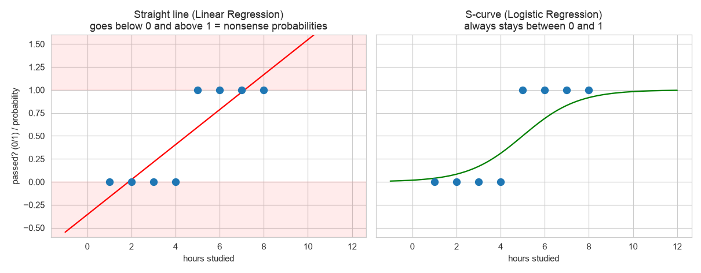
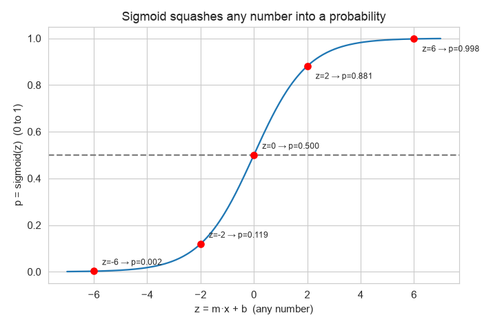
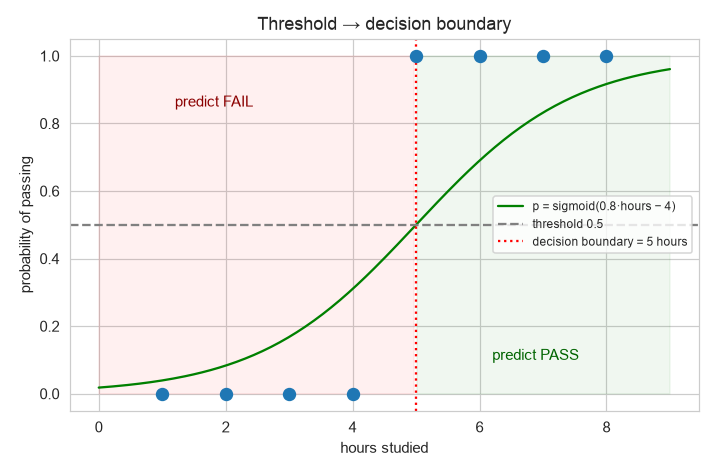
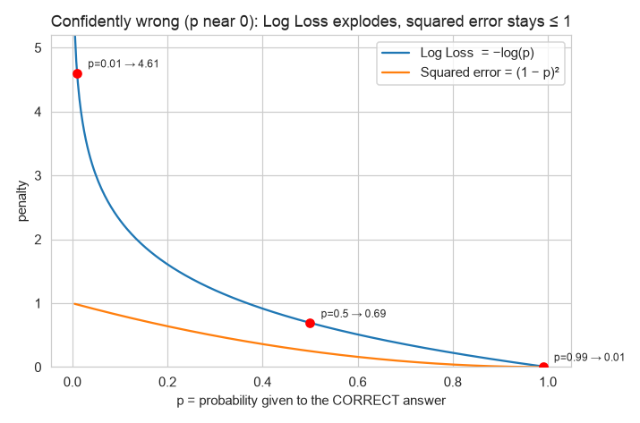
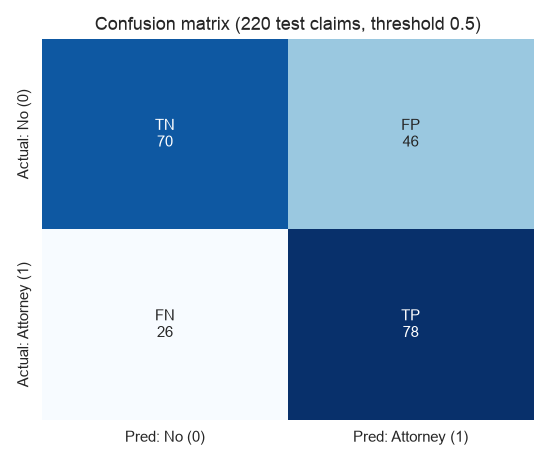
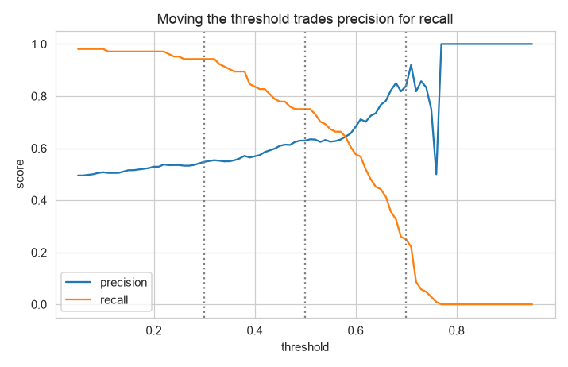
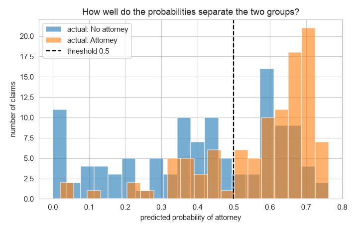
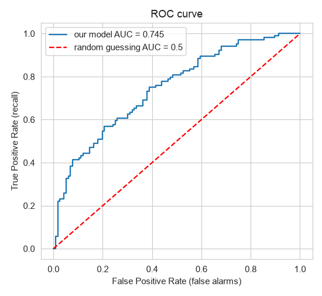
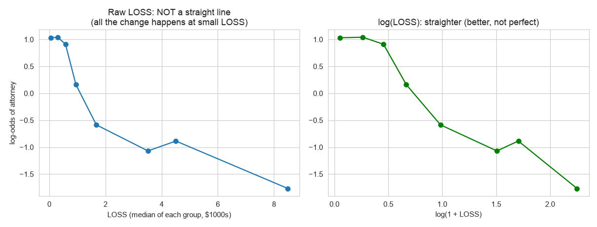

# Chapter 3 — Logistic Regression (Theory)

> **How to use the files in this folder**
> - **`theory.md` (this file):** learn the concepts. What each thing is, why it exists, how to read it, what to do about it.
> - **`scripting.ipynb`:** the real project (insurance claims → will the claimant hire an attorney?), run step by step with comments.
> - **`recap.md`:** written after you've learned the theory, for revision.
>
> Graphs are in `images/`. The toy graphs use the small exam example; the rest use the real `claim.csv` data.

**Notation:** plain `m`, `b`, `x`, `y`, same as Chapter 2. Elsewhere you may see `β` or `w` for the slopes, which is the same thing.

---

## 0. Where Logistic Regression sits

- **Supervised:** it learns from rows where the answer is known.
- **Classification:** it predicts a **category** (yes/no, spam/not spam), not a number. This chapter covers **binary** = exactly 2 categories.
- **Parametric:** like Chapter 2, it learns a few fixed numbers (`m`'s and `b`).

⚠️ **The name is a trap.** "Logistic **Regression**" is a **classification** algorithm. It's called regression only because it's built on Linear Regression's formula, as you'll see in §2.

**What it gives you:** not just "Yes/No", but a **probability**, e.g. *"73% chance this claimant hires an attorney."* That probability is often more useful than the yes/no itself.

---

## 1. Why can't we reuse Linear Regression?

**Toy example:** hours studied → did the student pass? (1 = pass, 0 = fail)

| Hours (x) | 1 | 2 | 3 | 4 | 5 | 6 | 7 | 8 |
|---|---|---|---|---|---|---|---|---|
| Passed (y) | 0 | 0 | 0 | 0 | 1 | 1 | 1 | 1 |

`0` and `1` are **labels** ("No", "Yes"), not quantities. Fit a straight line anyway:



**Left (a straight line) has two problems:**
1. **Nonsense outputs.** It keeps going forever, so 12 hours gives "1.4" (140% chance?) and −1 hours gives a negative chance. A probability must stay between 0 and 1.
2. **Wrong shape.** Near the tipping point (4–5 hours), one extra hour changes the outcome a lot. Far from it (1 hour or 8 hours), an extra hour barely matters. That's an **S-shape**, not a straight line.

**Right (an S-curve) fixes both.** It always stays between 0 and 1, and it's steep in the middle and flat at the ends. That's Logistic Regression.

---

## 2. How it works: 3 steps

### Step 1: the same linear formula as Chapter 2
```
z = m·x + b          (more features: z = m1·x1 + m2·x2 + … + b)
```
`z` is called the **score** (or **log-odds**, see §8). It can be any number, from −∞ to +∞. It isn't the answer yet.

### Step 2: squash `z` into a probability with the **Sigmoid** function
```
p = 1 / (1 + e^(−z))         e ≈ 2.718 (a fixed constant)
```
**Sigmoid** (also called the **logistic function**, which is where the name comes from) turns **any number into a value between 0 and 1**.



| z | −6 | −2 | −1 | **0** | 1 | 2 | 6 |
|---|---|---|---|---|---|---|---|
| p | 0.0025 | 0.119 | 0.269 | **0.500** | 0.731 | 0.881 | 0.9975 |

- Very negative `z` → p is close to 0. Very positive `z` → p is close to 1.
- **`z = 0` → p = 0.5 exactly.** That's the tipping point.
- It's steep in the middle and flat at the ends: the S-shape we needed.

### Step 3: apply a **threshold** to get a category
```
p ≥ 0.5  →  predict 1 (Yes)
p < 0.5  →  predict 0 (No)
```
0.5 is the default, but **you can change it** (§6.4).

### Worked example (exam data)
Say training learned `m = 0.8`, `b = −4.0`:

| Hours | z = 0.8x − 4 | p = sigmoid(z) | Predicted | Actual |
|---|---|---|---|---|
| 1 | −3.2 | 0.039 | 0 | 0 ✓ |
| 2 | −2.4 | 0.083 | 0 | 0 ✓ |
| 3 | −1.6 | 0.168 | 0 | 0 ✓ |
| 4 | −0.8 | 0.310 | 0 | 0 ✓ |
| 5 | 0.0 | 0.500 | 1 | 1 ✓ |
| 6 | 0.8 | 0.690 | 1 | 1 ✓ |
| 7 | 1.6 | 0.832 | 1 | 1 ✓ |
| 8 | 2.4 | 0.917 | 1 | 1 ✓ |

### Decision boundary
The **decision boundary** = the input value where `p = 0.5`, i.e. `z = 0`. Here: `0.8x − 4 = 0` → **x = 5 hours.**



Read it as: *"the model believes 5 hours is the tipping point between likely fail and likely pass."* With more features, the boundary is a line or plane that separates the two groups, instead of a single point.

---

## 3. Measuring "how wrong": Log Loss (not MSE)

### Why not reuse MSE from Chapter 2?
With probabilities, **some mistakes are much worse than others**:
- True answer is Yes, and the model says p = 0.45 → **unsure and slightly wrong.** That deserves a small penalty.
- True answer is Yes, and the model says p = 0.01 → **99% sure of the wrong answer.** That deserves a huge penalty.

Squared error can never be more than 1 here (the biggest possible gap is 1 − 0 = 1), so it **can't punish confident mistakes hard enough**. It also makes gradient descent work poorly with Sigmoid.

### Log Loss (also called Binary Cross-Entropy)
```
if actual = 1:  loss = −log(p)          p = probability the model gave to "Yes"
if actual = 0:  loss = −log(1 − p)      (1 − p) = probability it gave to "No"
```
In one line: `loss = −[ y·log(p) + (1−y)·log(1−p) ]`. Because `y` is either 0 or 1, one half always disappears.

**Simple way to think of it:** `loss = −log(probability the model gave to the CORRECT answer)`.



| Probability given to the correct answer | Log Loss | Meaning |
|---|---|---|
| 0.99 | **0.01** | confident and right → almost no penalty |
| 0.50 | **0.69** | coin flip → medium penalty |
| 0.01 | **4.61** | confident and wrong → **huge penalty** |

As confidence in the right answer approaches 0, the penalty **explodes toward infinity**. That's exactly the behaviour we wanted.

### Worked example (exam model)
| x | Actual | p | Prob. given to the correct answer | Loss |
|---|---|---|---|---|
| 1 | 0 | 0.039 | 0.961 | 0.040 |
| 4 | 0 | 0.310 | 0.690 | 0.371 |
| 5 | 1 | 0.500 | 0.500 | 0.693 |
| 8 | 1 | 0.917 | 0.917 | 0.087 |

The average over all 8 rows = **0.252**. **Training = finding the `m` and `b` that make the average Log Loss as small as possible.** It's the same idea as minimising MSE in Chapter 2, just with a different "wrongness" formula.

**Reading a Log Loss number:** lower is better. A model that always says 50/50 scores **0.693**, so you need to be below that to be useful. (Our real model: 0.609.)

> **GenAI link ⭐:** LLMs like GPT and Claude are trained with **exactly this loss** (cross-entropy). The only difference is that instead of 2 choices (yes/no), they choose among ~100,000 possible next words. Every time the model gives low probability to the correct next word, it gets a big loss, and gradient descent nudges billions of `m`'s to fix it.

---

## 4. Finding the best `m` and `b`: Gradient Descent only

Chapter 2 had two methods: **OLS** (a direct formula) and **Gradient Descent** (walking downhill).
**Logistic Regression has no direct formula**, because the `log` and the Sigmoid make the maths impossible to solve in one shot. So it **must** use gradient descent (or a smarter cousin of it):

```
repeat:
    compute p for every row      (z → sigmoid)
    compute average Log Loss
    nudge each m and b a little in the direction that lowers the loss
until the loss stops dropping
```

In sklearn: `LogisticRegression(max_iter=1000)`. `max_iter` = the **maximum number of steps** allowed. If you see a `ConvergenceWarning`, it ran out of steps before reaching the bottom. Raise `max_iter`, or **scale your features** (§9).

As always, **you don't do this by hand.** `.fit()` does it.

---

## 5. Reading the learned `m`'s (coefficients)

A coefficient changes `z` (the score), not the probability directly:
- **`m > 0`** → as this feature goes up, the probability of "Yes" goes **up**.
- **`m < 0`** → the probability of "Yes" goes **down**.
- **`m ≈ 0`** → little effect.

### Odds ratio: the human-readable version
Take `e^m`. This tells you how much the **odds** of "Yes" are multiplied when the feature goes up by 1.

Real coefficients from our claims model:

| Feature | m | e^m (odds ratio) | Plain English |
|---|---|---|---|
| CLMINSUR (claimant insured, 0/1) | +0.80 | **2.22** | Insured claimants have about **2.2× the odds** of hiring an attorney |
| CLMSEX (0/1) | +0.42 | 1.52 | Sex coded 1 has about 1.5× the odds |
| SEATBELT (0/1) | −0.50 | 0.61 | Wearing a seatbelt → odds × 0.61 (about 39% lower) |
| LOSS (per $1000) | −0.39 | 0.68 | Each extra $1000 of loss → odds × 0.68 |
| CLMAGE (per year) | +0.0055 | 1.006 | Tiny per year, but age spans 0–95, so it adds up |

⚠️ **Two cautions (same as Chapter 2):**
1. **Units matter.** A small `m` on a large-range feature (age) can still have a big total effect. You can't compare `m`'s directly unless the features are scaled (§9).
2. **Association ≠ cause.** "Insured → more attorneys" is a pattern in the data, not proof that insurance *causes* it. Multicollinearity (twin features) can also flip signs here, just like it did in Chapter 2.

---

## 6. Evaluating a classifier

Regression metrics (RMSE, R²) don't work, because the answers are categories. Classification has its own set. *(Chapter 4 covers each in full depth. This is what you need to read the notebook.)*

### 6.1 Train/test split with `stratify`
Same as Chapter 2 (learn on 80%, judge on the hidden 20%), plus **`stratify=y`**: it keeps the **same Yes/No ratio** in train and test. That's only meaningful for categories.

### 6.2 Baseline: always predict the most common class
The "no ML" answer for classification. Our test set: always predicting "No attorney" gives **52.7% accuracy**. The model must beat this.

### 6.3 Confusion matrix: the foundation of every metric
Count the 4 possible outcomes:



| | Predicted No | Predicted Yes |
|---|---|---|
| **Actually No** | **TN** = True Negative (correct "No") | **FP** = False Positive (**false alarm**) |
| **Actually Yes** | **FN** = False Negative (**missed case**) | **TP** = True Positive (correct "Yes") |

**Naming trick:** the 2nd word = what the model **predicted** (Positive = Yes). The 1st word = was it **right** (True) or **wrong** (False).
So a False Positive is a wrong "Yes" (false alarm), and a False Negative is a wrong "No" (a miss).

Our model on 220 test claims: **TN 70, FP 46, FN 26, TP 78.**

### 6.4 Metrics computed from the matrix

| Metric | Formula | Question it answers | Ours |
|---|---|---|---|
| **Accuracy** | (TP + TN) / all | What fraction did I get right? | (78+70)/220 = **0.673** |
| **Precision** | TP / (TP + FP) | When I say "Yes", how often am I right? | 78/124 = **0.629** |
| **Recall** | TP / (TP + FN) | Of all the real "Yes" cases, how many did I catch? | 78/104 = **0.750** |
| **F1** | balance of precision and recall | One number for both | **0.684** |

**Which one matters? It depends on which mistake costs the business more:**
- **Misses (FN) are expensive** → focus on **recall**. Examples: a cancer test, fraud, "this claim will get an attorney, so assign a senior adjuster".
- **False alarms (FP) are expensive** → focus on **precision**. Examples: a spam filter deleting real email, blocking a genuine customer.

⚠️ **Accuracy can lie.** If 99% of transactions are not fraud, "always say not fraud" scores 99% accuracy and catches zero fraud. Always check precision and recall too.

### 6.5 The threshold is a business knob
0.5 isn't sacred. Moving it trades precision against recall:



| Threshold | TN | FP | FN | TP | Precision | Recall |
|---|---|---|---|---|---|---|
| 0.3 (say Yes easily) | 35 | 81 | 6 | 98 | 0.547 | **0.942** |
| 0.5 (default) | 70 | 46 | 26 | 78 | 0.629 | 0.750 |
| 0.7 (say Yes rarely) | 111 | 5 | 78 | 26 | **0.839** | 0.250 |

- **Lower threshold** → catch more real cases (recall ↑), but more false alarms (precision ↓).
- **Higher threshold** → fewer false alarms (precision ↑), but miss more (recall ↓).
- **Pick the threshold based on the business cost**, not by default.

```python
proba = model.predict_proba(X_test)[:, 1]   # probabilities
pred  = (proba >= 0.3).astype(int)          # your own threshold
```

### 6.6 Do the probabilities separate the groups? ROC curve and AUC



A good model gives **high probabilities to real "Yes" cases and low ones to real "No" cases**, so the two colours are pulled apart. The more they overlap, the weaker the model.

**ROC curve** = recall vs false-alarm rate, plotted at **every** threshold. **AUC** = the area under it = **the chance that a random real "Yes" gets a higher probability than a random real "No".**



| AUC | Meaning |
|---|---|
| 0.5 | random guessing (the red diagonal) |
| 0.7–0.8 | useful |
| 0.8–0.9 | good |
| 1.0 | perfect separation |

Ours: **0.745**. AUC judges the **probabilities themselves**, independent of any one threshold. That's why it's the go-to number for **comparing models**.

### 6.7 Summary: which number to use when
| Want to… | Use |
|---|---|
| Check the model beats doing nothing | Accuracy vs the majority baseline |
| Know which mistakes it makes | Confusion matrix |
| Avoid misses | Recall |
| Avoid false alarms | Precision |
| Compare models fairly | **AUC** (and Log Loss) |
| Judge probability quality | **Log Loss** (lower = better, 0.693 = coin flip) |

---

## 7. Assumptions

| Assumption | Meaning | Applies to trees/RF? |
|---|---|---|
| **Linearity of the log-odds** | Each feature should move `z` (the score) in a **straight line**. It doesn't need to be straight against `p`, because the S-curve handles that. | ❌ trees don't need it |
| **Independence** | One row doesn't influence another | ✅ **all models** |
| **No multicollinearity** | Features aren't near-duplicates (coefficients become untrustworthy, same as Ch. 2) | ❌ mostly fine for trees |
| **Enough examples of each class** | A category with very few rows gives unreliable estimates. In our data only **20 claims** have SEATBELT = 1, so its coefficient is shaky. | ✅ all models suffer |

---

## 8. Odds and log-odds (what "linear in log-odds" means)

- **Odds** = `p / (1 − p)` = "how many times more likely is Yes than No". `p = 0.8` → odds = 0.8/0.2 = **4** ("4 to 1").
- **Log-odds** = `log(odds)`. **This is exactly `z`**, the straight-line score from §2, Step 1.

So Logistic Regression = **a straight line in log-odds**, which becomes an S-curve in probability.

**That's why the linearity assumption is about log-odds.** And it gives us a way to check it.

---

## 9. Diagnosing and improving the model

### 9.1 Check "linear in log-odds" for each numeric feature
Chapter 2 used the residual plot. For classification the equivalent is:
1. Cut the feature into ~8 groups (bins).
2. In each group, compute the % of "Yes", then convert it to log-odds.
3. Plot it. **A roughly straight line = OK. A bend = the assumption is broken.**



- **Raw LOSS (left):** strongly bent. All the change happens between $0 and ~$3k, then it flattens. That's because LOSS is **heavily skewed** (median 1.3, max 173).
- **log(1 + LOSS) (right):** much straighter. Not perfect, but a better fit for a straight-line model.
- **Fix:** replace LOSS with `np.log1p(LOSS)`. This is the classification version of Chapter 2's "add HP²". (`log1p(x) = log(1 + x)`, which is safe when x = 0.)

### 9.2 Underfitting vs overfitting
Same rule as Chapter 2: compare **train** and **test** scores.
- Both low → underfitting → better features, transformed features (log), or a more flexible model (trees, Ch. 5–6).
- Train ≫ test → overfitting → fewer features, more data, or stronger **regularization** (sklearn's `C` parameter: a smaller `C` means a simpler model, see Ch. 9).

### 9.3 Feature scaling
Gradient descent walks faster and more reliably when features have similar ranges (age 0–95 vs flags 0–1). Scaling with `StandardScaler` also makes the `m`'s directly comparable. It's not required for correct predictions, but it's good practice (Ch. 8).

### 9.4 Imbalanced classes
If "Yes" is rare (fraud: 1%), the model can ignore it and still look accurate. Tools: `stratify`, `class_weight="balanced"`, threshold moving, and resampling (Ch. 9). Our data is roughly balanced (47% Yes), so we're fine.

### 9.5 One test set can be noisy
220 test rows is small. A change can look worse on one split and better on average. **Cross-validation** (Ch. 7) averages over 5 different splits for a fairer comparison. The notebook shows this with log(LOSS).

### The improvement loop (same as Chapter 2)
```
train v1 → evaluate (accuracy vs baseline, confusion matrix, AUC, log loss)
→ diagnose (log-odds linearity, train vs test, coefficient signs, class balance)
→ apply the matching fix → retrain → compare on the same test set (+ CV)
→ choose the threshold based on business cost → ship
```

---

## 10. More than 2 categories (preview)

For 3+ classes (cat/dog/bird), use **Multinomial (Softmax) Logistic Regression**: one score `z` per class, and **softmax** turns all the scores into probabilities that **sum to 1**.

> **GenAI link ⭐:** an LLM predicting the next word is **softmax over its whole vocabulary + cross-entropy loss**. It's literally this chapter, scaled up.

---

## 11. The full mental model

1. **Score:** `z = m·x + b` (same as Linear Regression).
2. **Probability:** `p = sigmoid(z)`, always between 0 and 1, S-shaped.
3. **Decision:** `p ≥ threshold` → Yes. The threshold is a **business choice**.
4. **Wrongness:** **Log Loss** punishes confident mistakes hard. Training minimises it.
5. **Training:** gradient descent only (no direct formula).
6. **Reading it:** a positive `m` pushes toward Yes, and `e^m` = the odds multiplier.
7. **Evaluate:** baseline, confusion matrix, precision/recall, AUC, log loss.
8. **Improve:** check log-odds linearity (log-transform skewed features), train vs test, class balance, then tune the threshold.
